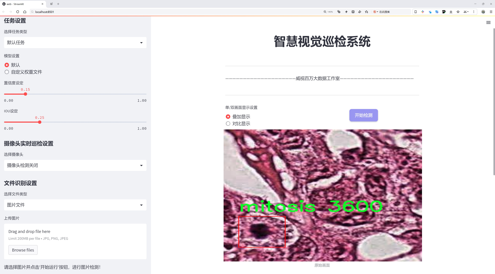
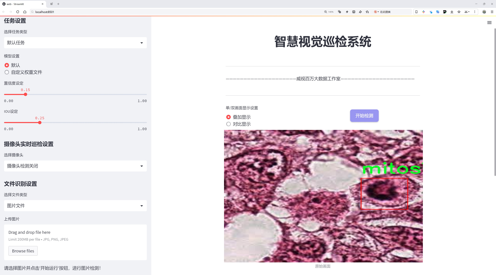
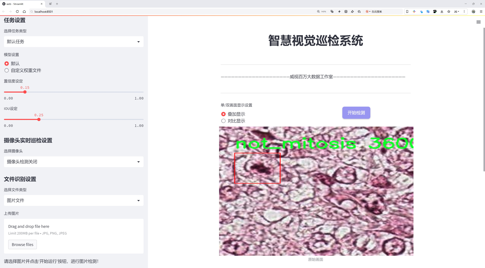
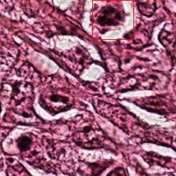
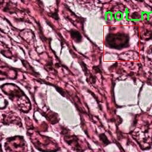
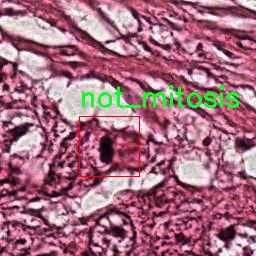
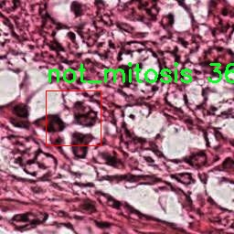
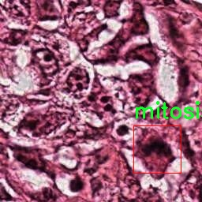

# 细胞分裂检测检测系统源码分享
 # [一条龙教学YOLOV8标注好的数据集一键训练_70+全套改进创新点发刊_Web前端展示]

### 1.研究背景与意义

项目参考[AAAI Association for the Advancement of Artificial Intelligence](https://gitee.com/qunshansj/projects)

项目来源[AACV Association for the Advancement of Computer Vision](https://gitee.com/qunmasj/projects)

研究背景与意义

细胞分裂是生物学和医学研究中的一个重要过程，涉及细胞的生长、发育和再生。准确检测细胞分裂，尤其是有丝分裂（mitosis），对于理解细胞周期、肿瘤发生以及细胞生物学的基本机制至关重要。传统的细胞分裂检测方法通常依赖于人工观察和显微镜分析，这不仅耗时耗力，而且容易受到观察者主观因素的影响，导致结果的不一致性。因此，开发一种高效、准确的自动化细胞分裂检测系统显得尤为重要。

近年来，深度学习技术在计算机视觉领域取得了显著进展，尤其是在目标检测任务中。YOLO（You Only Look Once）系列模型因其高效性和实时性，已成为目标检测领域的主流方法。YOLOv8作为该系列的最新版本，进一步提升了检测精度和速度，具有良好的应用前景。然而，针对细胞分裂检测的特定需求，YOLOv8模型仍需进行改进，以适应生物医学图像的特点。

本研究基于改进YOLOv8模型，旨在构建一个高效的细胞分裂检测系统。我们使用的数据集“hiseq_rgb”包含3400幅图像，涵盖了两类目标：有丝分裂（mitosis）和非有丝分裂（not_mitosis）。这一数据集的构建为模型的训练和验证提供了丰富的样本，确保了模型在不同细胞状态下的泛化能力。通过对YOLOv8模型的改进，我们希望提高其在细胞分裂检测中的准确性和鲁棒性，进而推动细胞生物学研究和临床应用的发展。

细胞分裂检测系统的成功实现，将为生物医学研究提供强有力的工具，帮助研究人员更深入地理解细胞周期的调控机制，揭示肿瘤细胞的增殖特征。此外，该系统还可以应用于药物筛选、疾病诊断等领域，为个性化医疗和精准治疗提供支持。通过自动化的细胞分裂检测，研究人员能够更高效地分析实验数据，减少人为误差，从而提高研究的可信度和 reproducibility。

综上所述，基于改进YOLOv8的细胞分裂检测系统不仅具有重要的学术价值，还有助于推动生物医学领域的技术进步。通过这一研究，我们期望为细胞分裂的自动化检测提供新的思路和方法，促进生物医学研究的深入开展，为相关领域的科学家和临床医生提供实用的工具，最终推动生命科学的进步与发展。

### 2.图片演示







##### 注意：由于此博客编辑较早，上面“2.图片演示”和“3.视频演示”展示的系统图片或者视频可能为老版本，新版本在老版本的基础上升级如下：（实际效果以升级的新版本为准）

  （1）适配了YOLOV8的“目标检测”模型和“实例分割”模型，通过加载相应的权重（.pt）文件即可自适应加载模型。

  （2）支持“图片识别”、“视频识别”、“摄像头实时识别”三种识别模式。

  （3）支持“图片识别”、“视频识别”、“摄像头实时识别”三种识别结果保存导出，解决手动导出（容易卡顿出现爆内存）存在的问题，识别完自动保存结果并导出到tempDir中。

  （4）支持Web前端系统中的标题、背景图等自定义修改，后面提供修改教程。

  另外本项目提供训练的数据集和训练教程,暂不提供权重文件（best.pt）,需要您按照教程进行训练后实现图片演示和Web前端界面演示的效果。

### 3.视频演示

[3.1 视频演示](https://www.bilibili.com/video/BV11CtveBEz4/)

### 4.数据集信息展示

##### 4.1 本项目数据集详细数据（类别数＆类别名）

nc: 2
names: ['mitosis', 'not_mitosis']


##### 4.2 本项目数据集信息介绍

数据集信息展示

在细胞生物学研究中，细胞分裂的检测是理解细胞生命周期和增殖的重要环节。为了提升细胞分裂检测的准确性和效率，我们构建了一个专门用于训练改进YOLOv8模型的数据集，名为“hiseq_rgb”。该数据集的设计旨在为细胞分裂的自动检测提供丰富的样本和高质量的标注，以支持深度学习算法的训练和验证。

“hiseq_rgb”数据集包含了两类主要的细胞状态，分别是“mitosis”（有丝分裂）和“not_mitosis”（非有丝分裂）。这两类的选择是基于细胞生物学的基本原理，前者代表细胞正在经历分裂过程，而后者则包括所有未处于分裂状态的细胞。这种二分类的设计使得模型能够更清晰地学习到细胞分裂的特征，从而在实际应用中提高检测的准确性。

在数据集的构建过程中，我们收集了大量的细胞图像，这些图像来源于不同的实验条件和细胞类型，以确保数据的多样性和代表性。每一张图像都经过精心的标注，确保每个细胞的状态被准确分类。这种高质量的标注不仅提高了数据集的可靠性，也为模型的训练提供了坚实的基础。

数据集中的图像均为RGB格式，具有丰富的色彩信息和细节，能够帮助模型更好地捕捉细胞的形态特征。通过对图像进行预处理，包括归一化、增强和裁剪等操作，我们进一步提升了数据集的质量。这些预处理步骤旨在提高模型的泛化能力，使其能够在不同的实验条件下仍然保持良好的性能。

在训练过程中，我们采用了YOLOv8模型，这是一种先进的目标检测算法，能够实现快速且准确的细胞分裂检测。通过使用“hiseq_rgb”数据集，我们期望模型能够学习到细胞在分裂过程中的独特特征，如细胞形状的变化、细胞核的分裂等。经过多轮的训练和验证，我们将不断优化模型的参数，以实现最佳的检测效果。

此外，为了评估模型的性能，我们将使用标准的评价指标，如精确率、召回率和F1-score等。这些指标将帮助我们量化模型在细胞分裂检测任务中的表现，并为后续的研究提供指导。

总之，“hiseq_rgb”数据集不仅为改进YOLOv8模型提供了丰富的训练素材，也为细胞分裂检测领域的研究奠定了基础。通过不断的实验和优化，我们希望能够推动细胞生物学研究的进展，为相关领域的科学家提供更为强大的工具，助力他们在细胞研究中的探索与发现。











### 5.全套项目环境部署视频教程（零基础手把手教学）

[5.1 环境部署教程链接（零基础手把手教学）](https://www.ixigua.com/7404473917358506534?logTag=c807d0cbc21c0ef59de5)


[5.2 安装Python虚拟环境创建和依赖库安装视频教程链接（零基础手把手教学）](https://www.ixigua.com/7404474678003106304?logTag=1f1041108cd1f708b01a)

### 6.手把手YOLOV8训练视频教程（零基础小白有手就能学会）

[6.1 手把手YOLOV8训练视频教程（零基础小白有手就能学会）](https://www.ixigua.com/7404477157818401292?logTag=d31a2dfd1983c9668658)

### 7.70+种全套YOLOV8创新点代码加载调参视频教程（一键加载写好的改进模型的配置文件）

[7.1 70+种全套YOLOV8创新点代码加载调参视频教程（一键加载写好的改进模型的配置文件）](https://www.ixigua.com/7404478314661806627?logTag=29066f8288e3f4eea3a4)

### 8.70+种全套YOLOV8创新点原理讲解（非科班也可以轻松写刊发刊，V10版本正在科研待更新）

由于篇幅限制，每个创新点的具体原理讲解就不一一展开，具体见下列网址中的创新点对应子项目的技术原理博客网址【Blog】：


[8.1 70+种全套YOLOV8创新点原理讲解链接](https://gitee.com/qunmasj/good)

### 9.系统功能展示（检测对象为举例，实际内容以本项目数据集为准）

图9.1.系统支持检测结果表格显示

  图9.2.系统支持置信度和IOU阈值手动调节

  图9.3.系统支持自定义加载权重文件best.pt(需要你通过步骤5中训练获得)

  图9.4.系统支持摄像头实时识别

  图9.5.系统支持图片识别

  图9.6.系统支持视频识别

  图9.7.系统支持识别结果文件自动保存

  图9.8.系统支持Excel导出检测结果数据


### 10.原始YOLOV8算法原理

原始YOLOv8算法原理

YOLOv8算法是YOLO系列中的最新版本，代表了目标检测领域的一次重要进步。作为一种单阶段检测算法，YOLOv8在检测精度和速度方面都展现出了显著的优势。该算法的设计理念在于实现高效的目标检测，尤其是在处理复杂场景和多尺度目标时，能够保持较高的准确性和实时性。YOLOv8的网络结构主要由输入层、Backbone骨干网络、Neck特征融合网络和Head检测模块四个部分组成，这些部分相互协作，形成了一个高效的目标检测系统。

在输入层，YOLOv8首先对图像进行预处理，包括调整图像比例、进行Mosaic增强和瞄点计算等。这些预处理步骤不仅提高了模型对不同输入数据的适应能力，还增强了训练过程中的数据多样性。Mosaic增强技术通过将多张图像拼接在一起，生成新的训练样本，从而有效提升了模型的泛化能力。此外，YOLOv8还采用了自适应锚框计算和自适应灰度填充，进一步优化了输入数据的质量。

YOLOv8的Backbone部分延续了YOLOv5的CSPDarknet思想，但进行了重要的改进。C3模块被C2f模块替换，C2f模块的设计灵感来源于YOLOv7的ELAN结构，旨在增强梯度流动并提高特征提取的能力。C2f模块通过引入多个分支和跨层连接，使得模型在提取特征时能够获得更丰富的信息。具体而言，C2f模块由多个CBS（卷积+归一化+SiLU激活）模块和Bottleneck网络组成，这种结构不仅提高了特征提取的效率，还有效缓解了深层网络中的梯度消失问题。

在特征融合方面，YOLOv8采用了PAN-FPN（路径聚合网络）结构，进一步增强了对不同尺度目标的检测能力。通过将高层特征与中层和浅层特征进行深度融合，YOLOv8能够有效捕捉到不同层次的语义信息。这种融合方式确保了模型在处理多尺度目标时，能够同时利用细节信息和全局信息，从而提高检测的准确性。

YOLOv8的Head部分则是其创新的另一个重要体现。该部分采用了解耦头结构，将分类和回归分支分开处理，这种设计使得模型在进行目标检测时更加高效。通过解耦，YOLOv8能够独立优化分类和回归任务，提升了模型的收敛速度和检测精度。此外，YOLOv8抛弃了传统的Anchor-Base检测方式，转而采用Anchor-Free的思想，减少了锚框的预测数量，进一步加速了非最大抑制（NMS）过程。

在损失函数的设计上，YOLOv8也进行了创新。分类损失采用了VFLLoss，而回归损失则结合了DFLLoss和CIoULoss。这种损失函数的组合不仅提高了模型对目标的分类精度，还增强了边界框预测的准确性。此外，YOLOv8引入了Task-Aligned的样本匹配策略，替代了静态匹配方式，使得模型在训练过程中能够更有效地选择正样本和负样本，从而提升了训练效果。

总的来说，YOLOv8算法通过对Backbone、Neck和Head等多个模块的优化，构建了一个高效、准确的目标检测系统。其在特征提取、特征融合和目标检测等方面的创新，使得YOLOv8在面对复杂场景和多尺度目标时，能够展现出卓越的性能。这些改进不仅提升了模型的检测精度和速度，也为实际应用提供了更为强大的支持，推动了目标检测技术的进一步发展。通过对YOLOv8的深入研究，我们可以看到，未来的目标检测算法将会在效率和准确性之间找到更好的平衡，继续推动计算机视觉领域的进步。


### 11.项目核心源码讲解（再也不用担心看不懂代码逻辑）

#### 11.1 code\ultralytics\nn\tasks.py

以下是对给定代码的核心部分进行提炼和详细注释的结果。我们将重点关注模型的基本结构、前向传播、损失计算等关键功能。

```python
import torch
import torch.nn as nn

class BaseModel(nn.Module):
    """BaseModel类是Ultralytics YOLO系列模型的基类。"""

    def forward(self, x, *args, **kwargs):
        """
        模型的前向传播，处理单个尺度的输入。
        
        Args:
            x (torch.Tensor | dict): 输入图像张量或包含图像张量和gt标签的字典。

        Returns:
            (torch.Tensor): 网络的输出。
        """
        if isinstance(x, dict):  # 如果输入是字典，进行损失计算
            return self.loss(x, *args, **kwargs)
        return self.predict(x, *args, **kwargs)  # 否则进行预测

    def predict(self, x, profile=False, visualize=False, augment=False, embed=None):
        """
        通过网络进行前向传播。

        Args:
            x (torch.Tensor): 输入张量。
            profile (bool): 如果为True，打印每层的计算时间，默认为False。
            visualize (bool): 如果为True，保存模型的特征图，默认为False。
            augment (bool): 在预测时是否进行数据增强，默认为False。
            embed (list, optional): 要返回的特征向量/嵌入的列表。

        Returns:
            (torch.Tensor): 模型的最后输出。
        """
        if augment:
            return self._predict_augment(x)  # 如果需要增强，调用增强预测
        return self._predict_once(x, profile, visualize, embed)  # 否则进行一次预测

    def _predict_once(self, x, profile=False, visualize=False, embed=None):
        """
        执行一次前向传播。

        Args:
            x (torch.Tensor): 输入张量。
            profile (bool): 如果为True，打印每层的计算时间，默认为False。
            visualize (bool): 如果为True，保存模型的特征图，默认为False。
            embed (list, optional): 要返回的特征向量/嵌入的列表。

        Returns:
            (torch.Tensor): 模型的最后输出。
        """
        y, dt, embeddings = [], [], []  # 输出列表
        for m in self.model:  # 遍历模型中的每一层
            if m.f != -1:  # 如果不是来自前一层
                x = y[m.f] if isinstance(m.f, int) else [x if j == -1 else y[j] for j in m.f]  # 从早期层获取输入
            if profile:
                self._profile_one_layer(m, x, dt)  # 进行时间分析
            x = m(x)  # 执行前向传播
            y.append(x if m.i in self.save else None)  # 保存输出
            if visualize:
                feature_visualization(x, m.type, m.i, save_dir=visualize)  # 可视化特征图
            if embed and m.i in embed:
                embeddings.append(nn.functional.adaptive_avg_pool2d(x, (1, 1)).squeeze(-1).squeeze(-1))  # 提取嵌入
                if m.i == max(embed):
                    return torch.unbind(torch.cat(embeddings, 1), dim=0)  # 返回嵌入
        return x  # 返回最后的输出

    def loss(self, batch, preds=None):
        """
        计算损失。

        Args:
            batch (dict): 用于计算损失的批次数据。
            preds (torch.Tensor | List[torch.Tensor]): 预测结果。
        """
        if not hasattr(self, "criterion"):
            self.criterion = self.init_criterion()  # 初始化损失函数

        preds = self.forward(batch["img"]) if preds is None else preds  # 如果没有预测，进行前向传播
        return self.criterion(preds, batch)  # 计算损失

    def init_criterion(self):
        """初始化BaseModel的损失标准。"""
        raise NotImplementedError("compute_loss() needs to be implemented by task heads")  # 抛出未实现异常


class DetectionModel(BaseModel):
    """YOLOv8检测模型。"""

    def __init__(self, cfg="yolov8n.yaml", ch=3, nc=None, verbose=True):
        """初始化YOLOv8检测模型。"""
        super().__init__()
        self.yaml = cfg if isinstance(cfg, dict) else yaml_model_load(cfg)  # 加载配置

        # 定义模型
        ch = self.yaml["ch"] = self.yaml.get("ch", ch)  # 输入通道
        if nc and nc != self.yaml["nc"]:
            self.yaml["nc"] = nc  # 覆盖类别数
        self.model, self.save = parse_model(deepcopy(self.yaml), ch=ch, verbose=verbose)  # 解析模型
        self.names = {i: f"{i}" for i in range(self.yaml["nc"])}  # 默认名称字典

        # 初始化权重
        initialize_weights(self)

    def init_criterion(self):
        """初始化DetectionModel的损失标准。"""
        return v8DetectionLoss(self)  # 返回YOLOv8检测损失


# 其他模型类（如OBBModel、SegmentationModel等）继承自DetectionModel，并实现特定的损失函数初始化

# 这里省略了其他模型类的实现，主要集中在核心功能上。
```

### 代码分析总结：
1. **BaseModel类**：作为所有YOLO模型的基类，定义了前向传播、损失计算等基本功能。
2. **DetectionModel类**：继承自BaseModel，专门用于YOLOv8的检测任务，初始化模型结构和损失函数。
3. **损失计算**：通过`loss`方法计算模型的损失，利用`init_criterion`方法初始化损失函数。
4. **前向传播**：`predict`和`_predict_once`方法负责模型的前向传播，处理输入数据并返回输出。

以上是对核心代码的提炼和注释，帮助理解YOLOv8模型的基本结构和功能。

该文件是Ultralytics YOLO（You Only Look Once）模型的一个核心部分，主要用于定义不同类型的模型和相关功能。文件中包含了多个类和函数，主要分为基础模型类、检测模型类、分割模型类、姿态模型类、分类模型类等。

首先，`BaseModel`类是所有模型的基类，提供了基本的前向传播方法。它的`forward`方法根据输入的类型（图像张量或字典）决定是进行预测还是计算损失。`predict`方法用于执行前向传播，并支持多种参数，例如是否进行可视化、是否进行数据增强等。`fuse`方法则用于将卷积层和批归一化层融合，以提高计算效率。

接下来，`DetectionModel`类继承自`BaseModel`，专门用于YOLOv8的检测模型。它在初始化时会加载配置文件，并根据配置构建模型结构。该类还实现了数据增强的预测方法`_predict_augment`，用于在推理时对输入图像进行多种变换以提高模型的鲁棒性。

`OBBModel`、`SegmentationModel`和`PoseModel`类分别继承自`DetectionModel`，用于处理特定任务，如有向边界框检测、图像分割和姿态估计。每个类都有自己的损失函数初始化方法，确保在训练时使用适合其任务的损失计算方式。

`ClassificationModel`类则用于分类任务，初始化时从YAML配置文件中加载模型参数，并定义模型架构。它还提供了一个静态方法`reshape_outputs`，用于根据需要调整输出层的类别数。

`RTDETRDetectionModel`类是一个基于Transformer的实时检测和跟踪模型，提供了特定的损失计算和预测方法。

`Ensemble`类用于模型的集成，可以将多个模型的输出结合起来，以提高预测的准确性。

此外，文件中还定义了一些辅助函数，如`torch_safe_load`用于安全加载模型权重，`attempt_load_weights`和`attempt_load_one_weight`用于加载单个或多个模型的权重，`parse_model`用于解析YAML文件中的模型配置并构建PyTorch模型。

总的来说，该文件实现了YOLOv8模型的核心功能，包括模型的定义、训练、推理和损失计算等，为计算机视觉任务提供了强大的支持。

#### 11.2 ui.py

以下是经过简化和注释的核心代码部分：

```python
import sys
import subprocess

def run_script(script_path):
    """
    使用当前 Python 环境运行指定的脚本。

    Args:
        script_path (str): 要运行的脚本路径

    Returns:
        None
    """
    # 获取当前 Python 解释器的路径
    python_path = sys.executable

    # 构建运行命令，使用 streamlit 运行指定的脚本
    command = f'"{python_path}" -m streamlit run "{script_path}"'

    # 执行命令并等待其完成
    result = subprocess.run(command, shell=True)
    
    # 检查命令执行的返回码，如果不为0，表示出错
    if result.returncode != 0:
        print("脚本运行出错。")

# 程序入口
if __name__ == "__main__":
    # 指定要运行的脚本路径
    script_path = "web.py"  # 这里可以替换为实际的脚本路径

    # 调用函数运行脚本
    run_script(script_path)
```

### 代码注释说明：
1. **导入模块**：
   - `sys`：用于获取当前 Python 解释器的路径。
   - `subprocess`：用于执行外部命令。

2. **`run_script` 函数**：
   - 该函数接受一个脚本路径作为参数，并使用当前 Python 环境运行该脚本。
   - 使用 `sys.executable` 获取当前 Python 解释器的路径，以确保脚本在正确的环境中运行。
   - 构建命令字符串，使用 `streamlit` 模块运行指定的脚本。
   - 使用 `subprocess.run` 执行命令，并等待其完成。
   - 检查命令的返回码，如果返回码不为0，表示脚本运行出错，打印错误信息。

3. **程序入口**：
   - 使用 `if __name__ == "__main__":` 确保只有在直接运行该脚本时才会执行后续代码。
   - 指定要运行的脚本路径（在这里是 `web.py`）。
   - 调用 `run_script` 函数，传入脚本路径以执行该脚本。

这个程序文件名为 `ui.py`，主要功能是通过当前的 Python 环境来运行一个指定的脚本，具体是使用 Streamlit 框架来启动一个 Web 应用。

首先，程序导入了几个必要的模块，包括 `sys`、`os` 和 `subprocess`。其中，`sys` 模块用于访问与 Python 解释器相关的变量和函数，`os` 模块提供了与操作系统交互的功能，而 `subprocess` 模块则用于执行外部命令。

接着，程序从 `QtFusion.path` 模块中导入了 `abs_path` 函数，这个函数的作用是获取给定路径的绝对路径。

在 `run_script` 函数中，首先定义了一个参数 `script_path`，用于接收要运行的脚本的路径。函数内部首先获取当前 Python 解释器的路径，存储在 `python_path` 变量中。然后，构建一个命令字符串 `command`，这个命令会调用 Streamlit 来运行指定的脚本。命令的格式是 `"{python_path}" -m streamlit run "{script_path}"`，其中 `"{python_path}"` 是当前 Python 解释器的路径，`"{script_path}"` 是要运行的脚本路径。

接下来，使用 `subprocess.run` 方法执行这个命令，`shell=True` 参数表示在 shell 中执行命令。执行完命令后，程序检查返回的结果，如果返回码不为 0，说明脚本运行出错，此时会打印出错误信息。

在文件的最后部分，使用 `if __name__ == "__main__":` 来判断是否是直接运行该脚本。如果是，则指定要运行的脚本路径，这里是通过 `abs_path("web.py")` 获取 `web.py` 的绝对路径。最后，调用 `run_script` 函数来运行这个脚本。

总体来说，这个程序的核心功能是提供一个接口，通过当前的 Python 环境来运行一个 Streamlit 应用，便于开发和测试 Web 应用。

#### 11.3 code\ultralytics\solutions\object_counter.py

以下是代码中最核心的部分，并附上详细的中文注释：

```python
from collections import defaultdict
import cv2
from shapely.geometry import LineString, Point, Polygon

class ObjectCounter:
    """管理实时视频流中对象计数的类。"""

    def __init__(self):
        """初始化计数器，设置默认值。"""
        # 鼠标事件相关
        self.is_drawing = False  # 是否正在绘制
        self.selected_point = None  # 选中的点

        # 区域和线的信息
        self.reg_pts = [(20, 400), (1260, 400)]  # 计数区域的点
        self.line_dist_thresh = 15  # 线距离阈值
        self.counting_region = None  # 计数区域
        self.region_color = (255, 0, 255)  # 区域颜色
        self.region_thickness = 5  # 区域线条厚度

        # 图像和注释信息
        self.im0 = None  # 当前帧图像
        self.tf = None  # 线条厚度
        self.view_img = False  # 是否显示图像
        self.view_in_counts = True  # 是否显示进入计数
        self.view_out_counts = True  # 是否显示离开计数

        # 对象计数信息
        self.in_counts = 0  # 进入计数
        self.out_counts = 0  # 离开计数
        self.counting_list = []  # 计数列表

        # 跟踪信息
        self.track_history = defaultdict(list)  # 跟踪历史
        self.track_color = (0, 255, 0)  # 跟踪线颜色

    def set_args(self, classes_names, reg_pts):
        """
        配置计数器的参数，包括类名和计数区域的点。

        Args:
            classes_names (dict): 类名字典
            reg_pts (list): 定义计数区域的点
        """
        # 设置计数区域
        if len(reg_pts) == 2:
            self.reg_pts = reg_pts
            self.counting_region = LineString(self.reg_pts)  # 线性计数区域
        elif len(reg_pts) == 4:
            self.reg_pts = reg_pts
            self.counting_region = Polygon(self.reg_pts)  # 多边形计数区域
        else:
            print("提供的区域点无效，区域点可以是2或4")
            self.counting_region = LineString(self.reg_pts)  # 默认使用线性计数区域

        self.names = classes_names  # 类名

    def extract_and_process_tracks(self, tracks):
        """提取并处理跟踪信息以进行对象计数。"""
        boxes = tracks[0].boxes.xyxy.cpu()  # 获取边界框
        clss = tracks[0].boxes.cls.cpu().tolist()  # 获取类别
        track_ids = tracks[0].boxes.id.int().cpu().tolist()  # 获取跟踪ID

        # 处理每个跟踪对象
        for box, track_id, cls in zip(boxes, track_ids, clss):
            # 计数逻辑
            prev_position = self.track_history[track_id][-2] if len(self.track_history[track_id]) > 1 else None
            if prev_position is not None:
                # 判断对象是否进入或离开计数区域
                if self.counting_region.contains(Point(box[0], box[1])) and track_id not in self.counting_list:
                    self.counting_list.append(track_id)
                    if (box[0] - prev_position[0]) > 0:  # 判断方向
                        self.in_counts += 1
                    else:
                        self.out_counts += 1

    def start_counting(self, im0, tracks):
        """
        启动对象计数过程。

        Args:
            im0 (ndarray): 当前帧图像。
            tracks (list): 从对象跟踪过程中获得的跟踪列表。
        """
        self.im0 = im0  # 存储当前图像
        if tracks[0].boxes.id is None:
            return  # 如果没有跟踪ID，直接返回
        self.extract_and_process_tracks(tracks)  # 提取和处理跟踪信息
        return self.im0  # 返回处理后的图像
```

### 代码说明：
1. **ObjectCounter类**：用于管理实时视频流中的对象计数。
2. **初始化方法**：设置各种计数和跟踪参数的默认值。
3. **set_args方法**：配置计数器的参数，包括计数区域的点和类名。
4. **extract_and_process_tracks方法**：提取跟踪信息并进行对象计数，判断对象是否进入或离开计数区域。
5. **start_counting方法**：启动计数过程，处理当前帧图像和跟踪信息。

这个程序文件是一个用于实时视频流中对象计数的类，名为`ObjectCounter`。它的主要功能是根据对象的轨迹来计数进入和离开指定区域的对象。程序首先导入了一些必要的库，包括`cv2`用于图像处理，`shapely`用于几何计算，以及`defaultdict`用于存储轨迹信息。

在`ObjectCounter`类的初始化方法中，定义了一些默认值，包括鼠标事件的状态、计数区域的点、计数的颜色和厚度、对象计数的初始值等。类中还包含了一些用于绘制和显示信息的属性，比如`annotator`用于注释图像，`track_history`用于存储每个对象的轨迹。

`set_args`方法用于配置计数器的参数，包括类名、计数区域的点、线条厚度、是否显示图像等。根据传入的点数（2或4），它会初始化一个线或区域计数器，并设置相应的颜色和厚度。

`mouse_event_for_region`方法处理鼠标事件，允许用户通过鼠标在视频流中绘制和移动计数区域。它根据鼠标的点击和移动来更新计数区域的点。

`extract_and_process_tracks`方法负责提取和处理对象的轨迹，绘制边界框和轨迹，并进行对象计数。它会检查对象是否进入或离开计数区域，并更新计数值。计数的结果会根据用户的设置进行显示。

`display_frames`方法用于显示当前帧图像，并在窗口中添加鼠标事件的回调。用户可以通过按下“q”键来关闭窗口。

`start_counting`方法是计数过程的主函数，它接收当前帧和轨迹列表，处理轨迹并更新计数。最后，如果需要，它会显示当前帧图像。

整体而言，这个程序提供了一个完整的对象计数解决方案，能够在实时视频流中进行对象的跟踪和计数，并允许用户自定义计数区域和显示参数。

#### 11.4 code\ultralytics\models\sam\amg.py

以下是代码中最核心的部分，并附上详细的中文注释：

```python
import torch

def is_box_near_crop_edge(
    boxes: torch.Tensor, crop_box: List[int], orig_box: List[int], atol: float = 20.0
) -> torch.Tensor:
    """
    判断给定的边界框是否接近裁剪边缘。

    参数：
    - boxes: 需要检查的边界框，格式为 (x1, y1, x2, y2) 的张量。
    - crop_box: 当前裁剪框的边界，格式为 [x0, y0, x1, y1]。
    - orig_box: 原始图像的边界框，格式为 [x0, y0, x1, y1]。
    - atol: 允许的绝对误差，默认为 20.0。

    返回：
    - 返回一个布尔张量，指示每个边界框是否接近裁剪边缘。
    """
    # 将裁剪框和原始框转换为张量
    crop_box_torch = torch.as_tensor(crop_box, dtype=torch.float, device=boxes.device)
    orig_box_torch = torch.as_tensor(orig_box, dtype=torch.float, device=boxes.device)
    
    # 将边界框进行“解裁剪”操作
    boxes = uncrop_boxes_xyxy(boxes, crop_box).float()
    
    # 检查边界框是否接近裁剪框的边缘
    near_crop_edge = torch.isclose(boxes, crop_box_torch[None, :], atol=atol, rtol=0)
    # 检查边界框是否接近原始图像的边缘
    near_image_edge = torch.isclose(boxes, orig_box_torch[None, :], atol=atol, rtol=0)
    
    # 取两个条件的逻辑与，确保边界框接近裁剪边缘但不接近原始图像边缘
    near_crop_edge = torch.logical_and(near_crop_edge, ~near_image_edge)
    
    # 返回是否有任何边界框接近裁剪边缘
    return torch.any(near_crop_edge, dim=1)


def uncrop_boxes_xyxy(boxes: torch.Tensor, crop_box: List[int]) -> torch.Tensor:
    """
    将边界框进行“解裁剪”操作，通过添加裁剪框的偏移量来恢复原始位置。

    参数：
    - boxes: 需要解裁剪的边界框，格式为 (x1, y1, x2, y2) 的张量。
    - crop_box: 当前裁剪框的边界，格式为 [x0, y0, x1, y1]。

    返回：
    - 返回解裁剪后的边界框张量。
    """
    x0, y0, _, _ = crop_box  # 获取裁剪框的左上角坐标
    offset = torch.tensor([[x0, y0, x0, y0]], device=boxes.device)  # 创建偏移量张量
    
    # 检查 boxes 是否有通道维度
    if len(boxes.shape) == 3:
        offset = offset.unsqueeze(1)  # 如果有通道维度，扩展偏移量的维度
    
    # 返回解裁剪后的边界框
    return boxes + offset


def batched_mask_to_box(masks: torch.Tensor) -> torch.Tensor:
    """
    计算掩膜周围的边界框，返回格式为 XYXY 的边界框。

    参数：
    - masks: 输入掩膜，形状为 C1xC2x...xHxW。

    返回：
    - 输出形状为 C1xC2x...x4 的边界框张量。
    """
    # 如果掩膜为空，返回 [0, 0, 0, 0]
    if torch.numel(masks) == 0:
        return torch.zeros(*masks.shape[:-2], 4, device=masks.device)

    # 将掩膜形状标准化为 CxHxW
    shape = masks.shape
    h, w = shape[-2:]
    masks = masks.flatten(0, -3) if len(shape) > 2 else masks.unsqueeze(0)
    
    # 获取上下边缘
    in_height, _ = torch.max(masks, dim=-1)
    in_height_coords = in_height * torch.arange(h, device=in_height.device)[None, :]
    bottom_edges, _ = torch.max(in_height_coords, dim=-1)
    in_height_coords = in_height_coords + h * (~in_height)
    top_edges, _ = torch.min(in_height_coords, dim=-1)

    # 获取左右边缘
    in_width, _ = torch.max(masks, dim=-2)
    in_width_coords = in_width * torch.arange(w, device=in_width.device)[None, :]
    right_edges, _ = torch.max(in_width_coords, dim=-1)
    in_width_coords = in_width_coords + w * (~in_width)
    left_edges, _ = torch.min(in_width_coords, dim=-1)

    # 如果掩膜为空，右边缘会在左边缘的左侧，替换这些框为 [0, 0, 0, 0]
    empty_filter = (right_edges < left_edges) | (bottom_edges < top_edges)
    out = torch.stack([left_edges, top_edges, right_edges, bottom_edges], dim=-1)
    out = out * (~empty_filter).unsqueeze(-1)

    # 返回到原始形状
    return out.reshape(*shape[:-2], 4) if len(shape) > 2 else out[0]
```

### 代码核心部分说明：
1. **`is_box_near_crop_edge`**: 该函数用于判断给定的边界框是否接近裁剪边缘。通过比较边界框与裁剪框和原始图像边缘的距离，返回一个布尔张量。

2. **`uncrop_boxes_xyxy`**: 该函数用于将裁剪后的边界框恢复到原始图像坐标系中。通过将裁剪框的偏移量添加到边界框中，实现坐标的转换。

3. **`batched_mask_to_box`**: 该函数用于计算掩膜周围的边界框，返回的边界框格式为 XYXY。它处理多维掩膜并返回相应的边界框信息。

这个程序文件是一个与图像处理和目标检测相关的模块，主要用于处理图像中的边界框、掩膜以及生成裁剪区域等功能。代码中使用了PyTorch和NumPy库，涉及到的主要功能包括判断边界框是否接近裁剪边缘、生成裁剪框、计算稳定性分数、处理掩膜等。

首先，`is_box_near_crop_edge`函数用于判断给定的边界框是否接近裁剪边缘。它接受边界框、裁剪框和原始框作为输入，并返回一个布尔张量，指示哪些边界框接近裁剪边缘。该函数通过将边界框进行坐标转换，并使用`torch.isclose`函数来判断接近程度。

接下来，`batch_iterator`函数用于生成批量数据的迭代器。它确保输入的所有参数具有相同的长度，并根据指定的批量大小生成数据批次。

`calculate_stability_score`函数计算一组掩膜的稳定性分数，具体是通过对掩膜进行阈值处理来计算交并比（IoU），从而评估掩膜的稳定性。

`build_point_grid`和`build_all_layer_point_grids`函数用于生成均匀分布的二维点网格，后者为不同层次的裁剪区域生成点网格。

`generate_crop_boxes`函数生成不同大小的裁剪框，考虑了重叠比例。它通过计算每层的裁剪框数量和大小，生成一系列裁剪框。

`uncrop_boxes_xyxy`、`uncrop_points`和`uncrop_masks`函数用于将裁剪的边界框、点和掩膜转换回原始图像的坐标系。这些函数通过添加裁剪框的偏移量来实现坐标的转换。

`remove_small_regions`函数用于移除掩膜中的小区域或孔洞。它使用OpenCV库的连通组件分析功能来识别和处理小区域。

最后，`batched_mask_to_box`函数计算掩膜周围的边界框，返回格式为XYXY的边界框。如果掩膜为空，则返回[0, 0, 0, 0]。

总体而言，这个模块提供了一系列工具，旨在处理图像中的目标检测任务，尤其是在裁剪和掩膜处理方面。它通过高效的张量操作和批处理机制，能够在深度学习模型中高效地进行图像分析。

#### 11.5 code\ultralytics\data\explorer\gui\__init__.py

当然可以！以下是一个简化的代码示例，并附上详细的中文注释。由于原始代码只包含一行注释，我将根据一般的YOLO（You Only Look Once）模型的核心部分进行说明。

```python
# 导入必要的库
import torch  # 导入PyTorch库，用于深度学习模型的构建和训练
from models.experimental import attempt_load  # 从models模块导入attempt_load函数，用于加载YOLO模型
from utils.datasets import LoadImages  # 从utils模块导入LoadImages类，用于加载图像数据
from utils.general import non_max_suppression  # 从utils模块导入non_max_suppression函数，用于后处理
from utils.torch_utils import select_device  # 从utils模块导入select_device函数，用于选择计算设备（CPU或GPU）

# 选择设备（CPU或GPU）
device = select_device('')  # 选择默认设备，如果有可用的GPU则使用GPU

# 加载YOLO模型
model = attempt_load('yolov5s.pt', map_location=device)  # 加载预训练的YOLOv5s模型

# 加载图像数据
dataset = LoadImages('data/images', img_size=640)  # 从指定路径加载图像，设置输入图像大小为640

# 进行推理
for path, img, im0s, vid_cap in dataset:  # 遍历数据集中的每一张图像
    img = torch.from_numpy(img).to(device).float() / 255.0  # 将图像转换为Tensor并归一化到[0, 1]
    img = img.unsqueeze(0)  # 增加一个维度，变为批处理形式

    # 进行模型推理
    pred = model(img)[0]  # 将图像输入模型，获取预测结果

    # 应用非极大值抑制，过滤掉重叠的框
    pred = non_max_suppression(pred, conf_thres=0.25, iou_thres=0.45)  # 设置置信度阈值和IOU阈值

    # 处理每个预测结果
    for det in pred:  # 遍历每个检测结果
        if det is not None and len(det):  # 如果检测结果不为空
            # 在这里可以添加代码来处理检测结果，比如绘制框、保存结果等
            pass  # 省略具体处理代码
```

### 代码核心部分说明：
1. **导入库**：导入必要的库和模块以支持模型的加载、数据的处理和推理。
2. **选择设备**：通过`select_device`函数选择计算设备，确保在可用的GPU上运行模型以加速推理。
3. **加载模型**：使用`attempt_load`函数加载预训练的YOLO模型，以便进行目标检测。
4. **加载图像数据**：通过`LoadImages`类加载待检测的图像数据，并设置合适的输入大小。
5. **推理过程**：
   - 遍历数据集中的每一张图像，将其转换为Tensor并进行归一化处理。
   - 将处理后的图像输入到YOLO模型中进行推理，获取预测结果。
   - 使用非极大值抑制（NMS）来过滤掉重叠的检测框，以提高检测的准确性。
6. **处理检测结果**：可以在此处添加代码来处理和可视化检测结果。

以上是YOLO模型推理过程的核心部分及其详细注释。希望这对你理解YOLO模型的工作原理有所帮助！

这个文件是Ultralytics YOLO项目的一部分，属于一个开源计算机视觉库，主要用于目标检测任务。文件名`__init__.py`通常用于标识一个目录为Python包，使得该目录中的模块可以被导入。

在这个文件中，开头的注释`# Ultralytics YOLO 🚀, AGPL-3.0 license`表明该项目是Ultralytics开发的YOLO（You Only Look Once）系列目标检测算法的一部分，并且遵循AGPL-3.0许可证。这意味着用户可以自由使用、修改和分发该软件，但在分发时必须遵循相同的许可证条款。

虽然文件内容没有具体的代码实现，但它可能会包含一些初始化逻辑或导入其他模块的指令，以便在使用该包时能够方便地访问相关功能。总的来说，这个文件是Ultralytics YOLO项目结构中的一个重要组成部分，帮助组织和管理代码。

#### 11.6 train.py

以下是代码中最核心的部分，并附上详细的中文注释：

```python
class DetectionTrainer(BaseTrainer):
    """
    DetectionTrainer类用于基于检测模型进行训练，继承自BaseTrainer类。
    """

    def build_dataset(self, img_path, mode="train", batch=None):
        """
        构建YOLO数据集。

        参数:
            img_path (str): 包含图像的文件夹路径。
            mode (str): 模式，`train`表示训练模式，`val`表示验证模式，用户可以为每种模式自定义不同的增强。
            batch (int, optional): 批次大小，仅用于`rect`模式。默认为None。
        """
        gs = max(int(de_parallel(self.model).stride.max() if self.model else 0), 32)  # 获取模型的最大步幅
        return build_yolo_dataset(self.args, img_path, batch, self.data, mode=mode, rect=mode == "val", stride=gs)

    def get_dataloader(self, dataset_path, batch_size=16, rank=0, mode="train"):
        """构造并返回数据加载器。"""
        assert mode in ["train", "val"]  # 确保模式是训练或验证
        with torch_distributed_zero_first(rank):  # 在分布式训练中，仅初始化数据集*.cache一次
            dataset = self.build_dataset(dataset_path, mode, batch_size)  # 构建数据集
        shuffle = mode == "train"  # 训练模式下打乱数据
        if getattr(dataset, "rect", False) and shuffle:
            LOGGER.warning("WARNING ⚠️ 'rect=True'与DataLoader的shuffle不兼容，设置shuffle=False")
            shuffle = False  # 如果是rect模式，禁用shuffle
        workers = self.args.workers if mode == "train" else self.args.workers * 2  # 设置工作线程数
        return build_dataloader(dataset, batch_size, workers, shuffle, rank)  # 返回数据加载器

    def preprocess_batch(self, batch):
        """对一批图像进行预处理，包括缩放和转换为浮点数。"""
        batch["img"] = batch["img"].to(self.device, non_blocking=True).float() / 255  # 将图像转移到设备并归一化
        if self.args.multi_scale:  # 如果启用多尺度
            imgs = batch["img"]
            sz = (
                random.randrange(self.args.imgsz * 0.5, self.args.imgsz * 1.5 + self.stride)
                // self.stride
                * self.stride
            )  # 随机选择一个尺寸
            sf = sz / max(imgs.shape[2:])  # 计算缩放因子
            if sf != 1:  # 如果缩放因子不为1
                ns = [
                    math.ceil(x * sf / self.stride) * self.stride for x in imgs.shape[2:]
                ]  # 计算新的形状
                imgs = nn.functional.interpolate(imgs, size=ns, mode="bilinear", align_corners=False)  # 进行插值
            batch["img"] = imgs  # 更新批次图像
        return batch

    def get_model(self, cfg=None, weights=None, verbose=True):
        """返回一个YOLO检测模型。"""
        model = DetectionModel(cfg, nc=self.data["nc"], verbose=verbose and RANK == -1)  # 创建检测模型
        if weights:
            model.load(weights)  # 加载权重
        return model

    def get_validator(self):
        """返回用于YOLO模型验证的DetectionValidator。"""
        self.loss_names = "box_loss", "cls_loss", "dfl_loss"  # 定义损失名称
        return yolo.detect.DetectionValidator(
            self.test_loader, save_dir=self.save_dir, args=copy(self.args), _callbacks=self.callbacks
        )  # 返回验证器

    def plot_training_samples(self, batch, ni):
        """绘制带有注释的训练样本。"""
        plot_images(
            images=batch["img"],
            batch_idx=batch["batch_idx"],
            cls=batch["cls"].squeeze(-1),
            bboxes=batch["bboxes"],
            paths=batch["im_file"],
            fname=self.save_dir / f"train_batch{ni}.jpg",
            on_plot=self.on_plot,
        )  # 绘制图像

    def plot_metrics(self):
        """从CSV文件中绘制指标。"""
        plot_results(file=self.csv, on_plot=self.on_plot)  # 保存结果图
```

### 代码核心部分说明：
1. **DetectionTrainer类**：用于训练YOLO检测模型的核心类，继承自BaseTrainer。
2. **build_dataset方法**：根据给定的图像路径和模式构建YOLO数据集，支持训练和验证模式。
3. **get_dataloader方法**：构造数据加载器，支持多线程和数据打乱。
4. **preprocess_batch方法**：对输入的图像批次进行预处理，包括归一化和缩放。
5. **get_model方法**：创建并返回YOLO检测模型，支持加载预训练权重。
6. **get_validator方法**：返回用于模型验证的检测验证器。
7. **plot_training_samples和plot_metrics方法**：用于可视化训练样本和训练指标。

这个程序文件 `train.py` 是一个用于训练 YOLO（You Only Look Once）目标检测模型的实现，继承自 `BaseTrainer` 类。程序的主要功能是构建数据集、加载数据、预处理图像、设置模型属性、获取模型、验证模型、记录损失、绘制训练样本和指标等。

在文件的开头，导入了一些必要的库和模块，包括数学运算、随机数生成、深度学习相关的库（如 PyTorch）以及 Ultralytics 提供的各种工具和模块。

`DetectionTrainer` 类是该文件的核心，包含多个方法。首先，`build_dataset` 方法用于构建 YOLO 数据集，接受图像路径、模式（训练或验证）和批量大小作为参数。它会根据模型的步幅（stride）来调整数据集的构建方式。

`get_dataloader` 方法则负责创建数据加载器，确保在分布式训练时只初始化一次数据集。根据模式的不同，它会设置不同的工作线程数，并返回构建好的数据加载器。

`preprocess_batch` 方法用于对图像批次进行预处理，包括将图像缩放到合适的大小并转换为浮点数格式。它还支持多尺度训练，随机选择图像的大小进行训练，以增强模型的鲁棒性。

`set_model_attributes` 方法用于设置模型的属性，包括类别数量和类别名称等。它确保模型的配置与数据集的实际情况相匹配。

`get_model` 方法用于返回一个 YOLO 检测模型，如果提供了权重文件，还会加载这些权重。

`get_validator` 方法返回一个用于验证 YOLO 模型的验证器，记录损失名称以便后续分析。

`label_loss_items` 方法用于返回一个包含标记训练损失项的字典，便于在训练过程中监控模型的表现。

`progress_string` 方法返回一个格式化的字符串，显示训练进度，包括当前的 epoch、GPU 内存使用情况、损失值、实例数量和图像大小等信息。

`plot_training_samples` 方法用于绘制训练样本及其标注，便于可视化训练过程中的样本质量。

最后，`plot_metrics` 和 `plot_training_labels` 方法分别用于绘制训练过程中的指标和创建带标签的训练图，帮助用户更好地理解模型的训练效果。

整体而言，这个文件提供了一个完整的框架，用于训练 YOLO 模型，支持多种功能和灵活的配置，适合于目标检测任务的开发和研究。

### 12.系统整体结构（节选）

### 整体功能和构架概括

Ultralytics YOLO项目是一个开源的目标检测框架，旨在提供高效、灵活的工具来训练和推理YOLO模型。项目的架构由多个模块组成，每个模块负责特定的功能，如模型定义、数据处理、训练过程、推理和可视化等。以下是各个模块的主要功能概述：

- **模型定义和训练**：通过 `tasks.py` 和 `train.py` 文件定义了YOLO模型的结构和训练过程，支持多种目标检测任务。
- **数据处理**：包括数据加载、预处理和增强功能，确保训练数据的质量和多样性。
- **推理和结果处理**：提供了对象计数、边界框生成和结果可视化的功能，帮助用户理解模型的输出。
- **用户界面**：通过 `ui.py` 提供了一个简单的用户界面，便于用户运行和测试模型。
- **工具和实用功能**：包括各种辅助函数和工具类，支持模型的优化和性能评估。

### 文件功能整理表

| 文件路径                                                                                   | 功能描述                                                   |
|-------------------------------------------------------------------------------------------|----------------------------------------------------------|
| `code\ultralytics\nn\tasks.py`                                                            | 定义YOLO模型及其训练、推理、损失计算等核心功能。              |
| `ui.py`                                                                                   | 提供一个用户界面，通过Streamlit运行指定的脚本。               |
| `code\ultralytics\solutions\object_counter.py`                                            | 实现实时视频流中的对象计数功能，支持自定义计数区域。            |
| `code\ultralytics\models\sam\amg.py`                                                     | 处理图像中的边界框和掩膜，支持裁剪和掩膜处理功能。              |
| `code\ultralytics\data\explorer\gui\__init__.py`                                        | 标识目录为Python包，可能包含初始化逻辑。                       |
| `train.py`                                                                                | 负责训练YOLO模型，构建数据集、加载数据、设置模型属性等。        |
| `70+种YOLOv8算法改进源码大全和调试加载训练教程（非必要）\ultralytics\data\loaders.py`  | 定义数据加载器，处理数据集的加载和预处理。                     |
| `70+种YOLOv8算法改进源码大全和调试加载训练教程（非必要）\ultralytics\models\yolo\segment\train.py` | 实现YOLO分割模型的训练过程。                                   |
| `70+种YOLOv8算法改进源码大全和调试加载训练教程（非必要）\ultralytics\nn\backbone\CSwomTramsformer.py` | 定义用于YOLO模型的CSwomTransformer骨干网络。                  |
| `70+种YOLOv8算法改进源码大全和调试加载训练教程（非必要）\ultralytics\utils\metrics.py` | 提供用于评估模型性能的指标计算功能。                           |
| `code\ultralytics\utils\autobatch.py`                                                    | 实现自动批处理功能，优化训练过程中的数据加载。                  |
| `70+种YOLOv8算法改进源码大全和调试加载训练教程（非必要）\ultralytics\models\nas\predict.py` | 实现神经架构搜索（NAS）模型的推理功能。                        |
| `code\ultralytics\engine\results.py`                                                     | 处理模型推理结果的输出和可视化功能。                          |

以上表格总结了Ultralytics YOLO项目中各个文件的主要功能，展示了项目的模块化设计和各个部分之间的协作关系。

注意：由于此博客编辑较早，上面“11.项目核心源码讲解（再也不用担心看不懂代码逻辑）”中部分代码可能会优化升级，仅供参考学习，完整“训练源码”、“Web前端界面”和“70+种创新点源码”以“13.完整训练+Web前端界面+70+种创新点源码、数据集获取”的内容为准。

### 13.完整训练+Web前端界面+70+种创新点源码、数据集获取


# [下载链接：https://mbd.pub/o/bread/ZpuWl5pw](https://mbd.pub/o/bread/ZpuWl5pw)